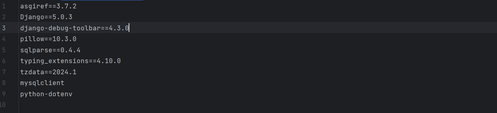
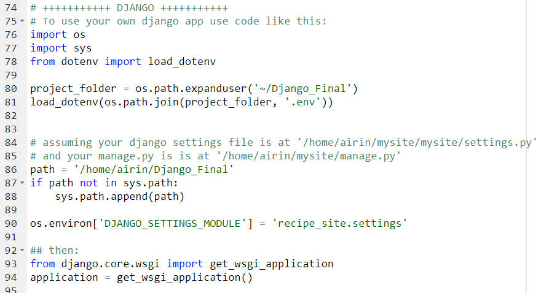

# Итоговая аттестация
## *Проект “Сайт рецептов” на Django*
Проект размещен по адресу - https://airin.pythonanywhere.com
###

### Цель проекта:
Создать и развернуть на сервере рабочий проект сайта рецептов с предоставлением пользователям возможности 
зарегистрироваться на сайте, входить в систему, добавлять свои рецепты, редактировать рецепты, а также выходить из системы.

### Основные функции и возможности:
- Аутентификация пользователя: 
     - регистрация
     - вход в систему
     - выход из системы
     - сброс пароля
- Форма добавления рецепта авторизованными пользователями
- Форма редактирования рецепта авторизованными пользователями

### Инструкции по установке и запуску проекта
1. Зарегистрироваться на www.pythonanywhere.com
2. Настроить безопасность в файле settings.py:  
DEBUG = False  
SESSION_COOKIE_SECURE = True  
CSRF_COOKIE_SECURE = True  
3. Настроить доступ в файле settings.py:  
SECRET_KEY = os.getenv('SECRET_KEY')  
ALLOWED_HOSTS = [  

    'username.pythonanywhere.com',
]  
STATIC_ROOT = BASE_DIR / 'static/'
4. Настроить подключение к базе данных на вкладке Database
5. Настроить подключение к базе данных в settings.py:
  
6. Сформировать список пакетов:  
    >> pip freeze > requirements.txt 
7. В созданном файле requirements.txt добавить mysqlclient, python-dotenv:  
 
8. В файле urls.py проекта удалить/закомментировать:
path('\_\_debug_\_\', include('debug_toolbar.urls'):  
9. На PythonAnywhere в консоли Bash вставить ссылку для клонирования проекта из GitHub: 
 
10. В той же консоли создать виртуальное окружение:
>>mkvirtualenv --python=/usr/bin/python3.10 virtualenv
11. Установить необходимые пакеты:  
>> cd myproject  
>> pip install -r requirements.txt  
12. На вкладке WEB создать новое веб-приложение, кликнув на "Add a new web app"
13. Настроить пути, в том числе указать название директории и путь к статическим файлам /static/
14. В разделе Code вкладки WEB перейти по ссылке, указанной для WSGI configuration file и внести следующие изменения в файл:
 
15. В разделе Virtualenv вкладки WEB открыть консоль Start a console in this Virtualenv:
>> python  
>> import secrets  
>> secrets.token_hex()  
>> exit()  
16. Скопировать полученный секретный ключ и вставить вместо <secret_key>, также вставить пароль к базе данных, который ранее был установлен при настройке подключения к БД:
>> echo "export "SECRET_KEY=<secret_key>" >> .env  
>> echo "export "MYSQL_PASSWORD=<dbpassword>" >> .env  
>> echo 'set -a; source ~/Django_Final/.env; set +a' >> ~/.virtualenvs/virtualenv/bin/postactivate  
>> exit()  
17. Выполнить миграции, собрать статические файлы и создать суперпользователя в консоли виртуального окружения:
>> python manage.py migrate  
>> python manage.py collectstatic  
>> python manage.py createsuperuser

 

### Используемые технологии и инструменты:
- Язык программирования: Python 3.10.11
- Фреймворк: Django 5.0.3
- СУБД: SQLite3
- Среда разработки: PyCharm
- Система контроля версий: Git
- Язык разметки: HTML
- Сервер: www.pythonanywhere.com

